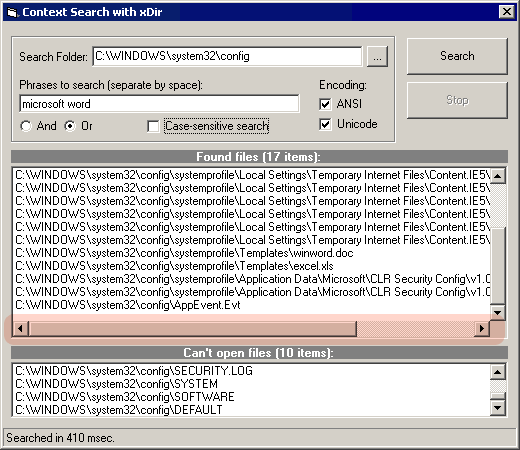



## ListBoxHScroll class \(update\)

### Description

A utility class for adding/hiding the horizontal scroll bar in the ListBox control dynamically taking into account its font (using the IFont interface). The code uses the SendMessage API function to add a horizontal scroll bar dynamically to a list box using the LB_SETHORIZONTALEXTENT message. To precisely calculate the width of a new item, our class uses the DrawText API function with the DT_CALCRECT flag. Draw attention at the fact that our class works properly if you change the font of the listbox as you want. We use the IFont interface and its hFont property to retrieve the handle of the font used in the listbox. Our class can also calculate the minimum width of the list box when the horizontal scroll bar disappears (it takes into account the visibility of the vertical scroll bar in the listbox; it determines whether this scroll bar is present by retrieving the listbox style flags and testing these set of flags for WS_VSCROLL).
 
### More Info
 

             |
---                |---
**Submitted On**   |2003-03-13 15:13:58
**By**             |[10Tec Company](https://github.com/Planet-Source-Code/PSCIndex/blob/master/ByAuthor/10tec-company.md)
**Level**          |Intermediate
**User Rating**    |5.0 (15 globes from 3 users)
**Compatibility**  |VB 4\.0 \(32\-bit\), VB 5\.0, VB 6\.0
**Category**       |[Custom Controls/ Forms/  Menus](https://github.com/Planet-Source-Code/PSCIndex/blob/master/ByCategory/custom-controls-forms-menus__1-4.md)
**World**          |[Visual Basic](https://github.com/Planet-Source-Code/PSCIndex/blob/master/ByWorld/visual-basic.md)
**Archive File**   |[ListBoxHSc1559693152003\.zip](https://github.com/Planet-Source-Code/10tec-company-listboxhscroll-class-update__1-44019/archive/master.zip)

